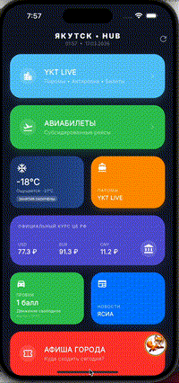
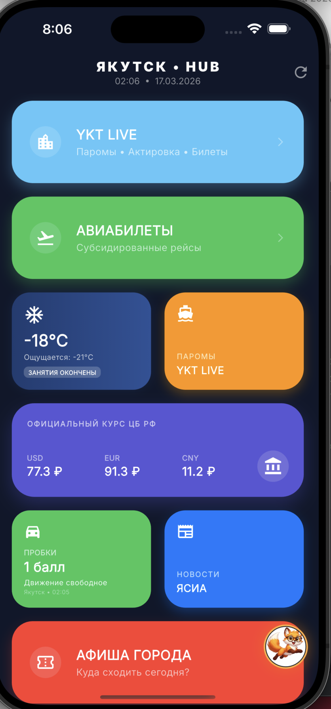
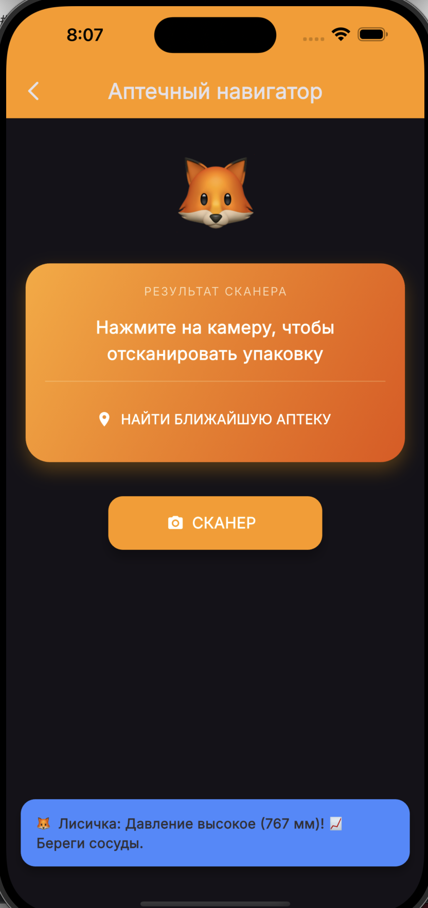
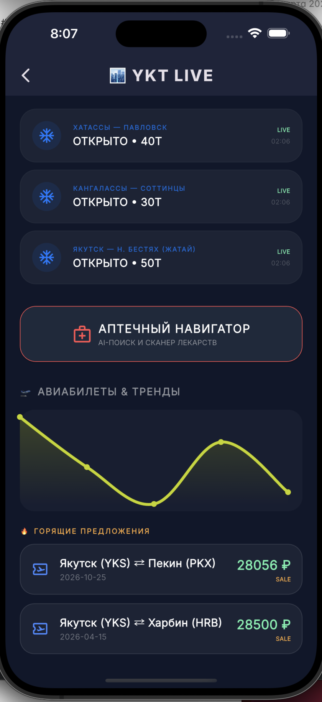
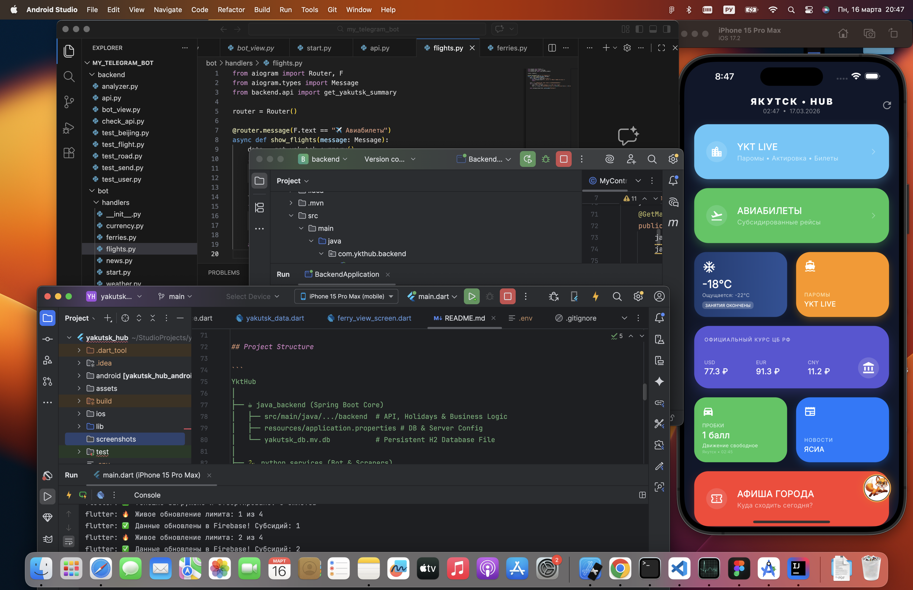
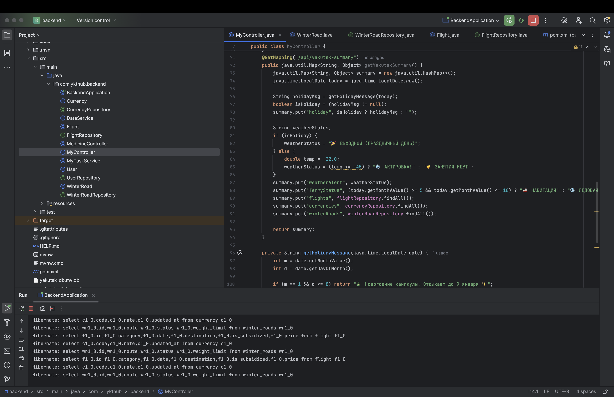

# YktHub — Yakutsk Local Services Platform


---

## Project Overview

YktHub is a mobile application for residents of Yakutsk and the Sakha Republic (Yakutia).  
The platform integrates a **Flutter mobile app**, a **Java backend (Spring Boot)**, and a **Python Telegram bot** to provide everyday local services adapted to extreme Arctic conditions.

The platform solves practical local problems such as harsh winters, river transportation across the Lena River, regional flight management, school notifications, and local news delivery.

---

## Key Features

- Weather information with snowfall animation   
- School cancellation due to extreme cold  
- Ferry schedule across the **Lena River** — one of the widest rivers in the world  
- Flight ticket search with **subsidized ticket sorting**  
- Currency exchange including **Chinese Yuan**, important for the Russian Far East  
- Telegram bot integration for quick access to services  
- Local news updates

- The project demonstrates how technology can be adapted for **Arctic and Far North conditions**.

---

## Architecture

The project follows a **Single Source of Truth** architecture, where the Java backend centralizes all business logic and data storage.

```text
      Flutter App       Telegram Bot
            │                   │
            └───────┬───────────┘
                    ▼
          Java Backend ☕ (Spring Boot)
                    │
            ┌───────┴───────┐
            ▼               ▼
      H2 Database   Python Scrapers

```

The mobile app communicates with a lightweight Python backend which also serves the Telegram bot.

---

## Tech Stack

### Mobile (Flutter)
- Dart  
- Firebase  
- Cubit (Flutter Bloc State Management)
- fl_chart (Data Visualization)

### Backend Core (Java)
- Java 17  
- Spring Boot 3  
- Spring Data JPA  
- H2 Database (Persistent)

### Automation & Bot (Python)
- Python 3.10  
- Aiogram 3.x  
- REST API  
- Pytz (Timezones)

### Other Tools
- Git  
- GitHub
- Postman

---

## Project Structure

```
YktHub
│
├── java_backend (Spring Boot Core)
│   ├── src/main/java/.../backend  # API, Holidays & Business Logic
│   ├── resources/application.properties # DB & Server Config
│   └── yakutsk_db.mv.db           # Persistent H2 Database File
│
├── python_services (Bot & Scrapers)
│   ├── bot/handlers               # Telegram command logic
│   ├── bot/keyboards/menu.py      # Keyboard layouts
│   └── backend/test_*.py          # Python scrapers (S7, News)
│
└── flutter_app (Mobile Client)
    ├── lib/screens                # UI: YKT LIVE & Summary
    └── lib/widgets                # Neon UI & Price Charts

```

---

## Demo

### Flight Subsidized Booking


### Medication OCR Navigator


---

## Screenshots

### Main Dashboard UI


---

### Smart Weather Snackbar


---

### Neon Price Analytics


---

### System Architecture


---

### Backend Logs (Spring Boot + Hibernate)


---

## How to Run the Project

### Clone repository

```
git clone https://github.com/maria-popova-dev/yakutsk_hub.git
```

### Flutter application

```
cd flutter_app
flutter pub get
flutter run
```

### Telegram bot

```
cd python_services
pip install -r requirements.txt
python main.py
```

### Backend API

```
cd java_backend
./mvnw spring-boot:run
```

---

## Technical Highlights

- Built a complete Flutter mobile application  
- Visualized analytical data with Neon UI and fl_chart  
- State management with Cubit (Flutter Bloc)  
- Developed a professional Java Spring Boot backend  
- Persistent storage using H2 Database  
- Created an asynchronous Telegram bot with Aiogram  
- Automated data collection via Python scrapers  
- Unified REST API for mobile app and bot synchronization  
- Adapted solutions for Arctic conditions (school notifications, Timezones)  
- Managed a complex multi-component project (Java, Python, Flutter) 

---

## About Me

Maria Popova  
Flutter Developer | Year-Long Program Graduate

Passionate about creating mobile applications and constantly learning new technologies.

Open to collaboration and new opportunities.

Contact:

Email: maria.popova.dev@outlook.com  
GitHub: https://github.com/maria-popova-dev

---

## License

This project is licensed under the MIT License.

---

## Quote

"The journey of a thousand miles begins with a single step."


